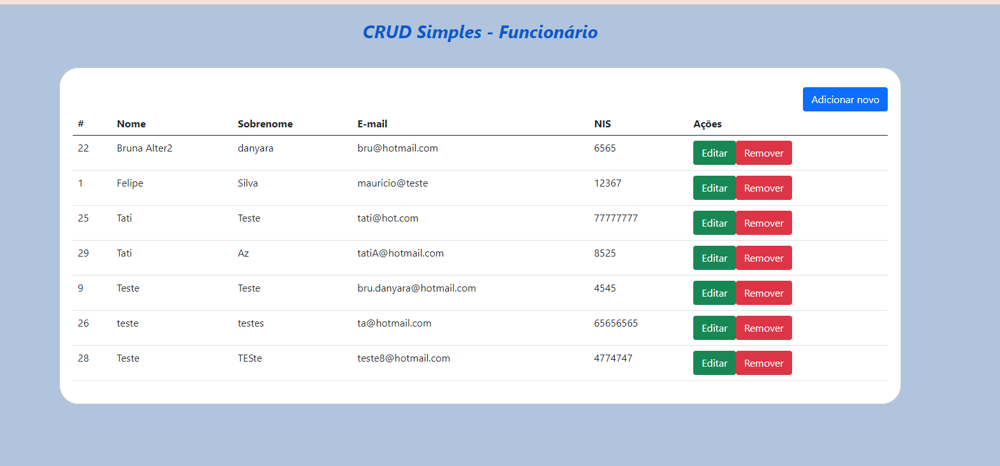

# Api_SpringBoot_Funcionario
CRUD Simples, cadastro de funcionário

## Features
**Back-End**
-**Java** — Java is an object-oriented programming language.
-**Spring Boot** — Spring Boot is an open source framework used to facilitate application configurations.

**Front-End**
-**JavaScript** - JavaScript is a structured, high-level scripting, dynamically typed, multiparadigm, interpreted programming language.
-**HTML** - HTML is a markup language used to build web pages. HTML documents can be interpreted by browsers.
-**CSS** - CSS is called the Cascading Style Sheet language and is used to style elements written in a markup language like HTML.

**API**
-**API REST** - Application programming interface (API or web API) that conforms to the constraints of the REST architecture style, allowing interaction with RESTful web services.

**Database**
- **MySql** — MySQL is a database management system, which uses the SQL language as an interface.

## Getting started

1. Clone this repo using `git clone git@github.com:brunadanyara/api_SpringBoot_Funcionario.git`
2. Move yourself to the appropriate directory.
3. Execute Mysql or run this command in your docker: `docker run --name some-mysql -e MYSQL_ROOT_PASSWORD=system -d mysql:8.0`

### Getting started with the backend server
1. Run Back-end project in Intellij IDE (default is 'http://localhost:8080').

### Getting started with the frontend app
1. Execute file ./frontEnd/index.html to run the frontend (default is http://localhost:3000).

### Getting started with the API 
1. GET - Default is 'http://localhost:8080/funcionario' or 'http://localhost:8080/funcionario/id' .
PUT or POST - Default is 'http://localhost:8080/funcionario' .
DEL - Default is 'http://localhost:8080/id' .
2. Used JSON format in the application.
